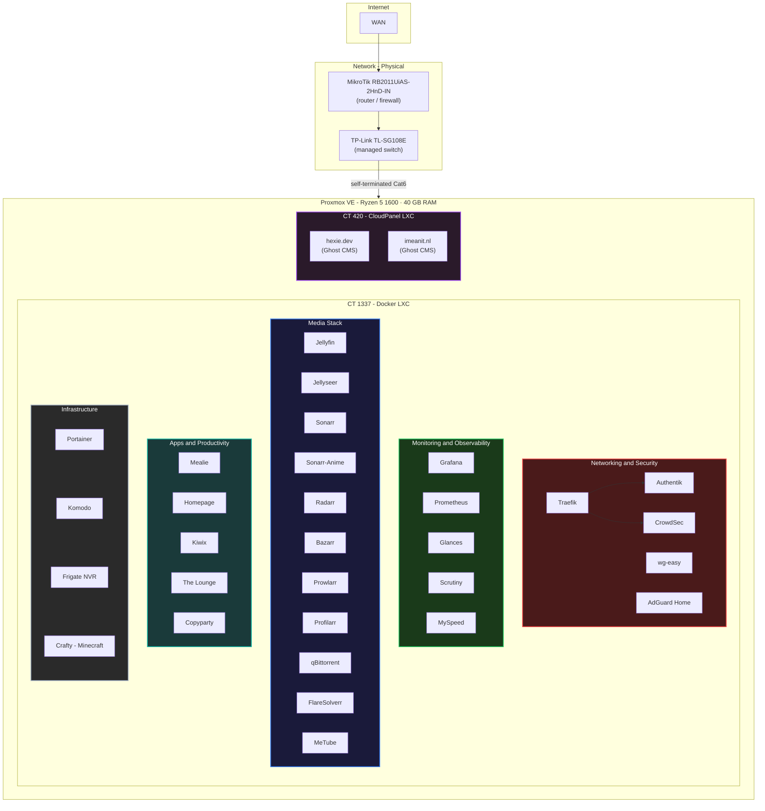

# - Homelab -

Self-hosted infrastructure running on Proxmox VE, fully containerized with Docker Compose. Each service lives in its own directory with a `docker-compose.yml` - clone and deploy.

> **Why?** Because cloud subscriptions add up, self-hosting teaches you more in a weekend than a month of tutorials, and it's fun.

---

## -> Architecture



---

## -> Hardware

| Component | Spec |
|---|---|
| **CPU** | AMD Ryzen 5 1600 (6C/12T) |
| **RAM** | 40 GB DDR4 |
| **Boot** | ZFS NVMe mirror (root pool) |
| **Storage** | 18 TB HDD <!-- TODO: add more detail if needed --> |
| **Hypervisor** | Proxmox VE |
| **Router** | MikroTik RB2011UiAS-2HnD-IN |
| **Switch** | TP-Link TL-SG108E (managed) |
| **Cabling** | Self-terminated Cat6 |

---

## -> Services 

35+ containers, each with its own Compose file. Grouped by function:

### Networking and Security
| Service | What it does |
|---|---|
| [Traefik](traefik/) | Reverse proxy with automatic TLS via Let's Encrypt |
| [Authentik](authentik/) | SSO and identity provider - SAML, OAuth2, LDAP |
| [CrowdSec](crowdsec/) | Collaborative IDS/IPS - behavioral threat detection |
| [wg-easy](wg-easy/) | WireGuard VPN with a web UI |
| [AdGuard Home](adguard/) | Network-wide DNS filtering and ad blocking |

### Monitoring and Observability
| Service | What it does |
|---|---|
| [Grafana](grafana/) | Dashboards and visualization |
| [Prometheus](prometheus/) | Metrics collection and alerting |
| [Glances](glances/) | Real-time system monitoring |
| [Scrutiny](scrutiny/) | S.M.A.R.T. disk health monitoring |
| [MySpeed](myspeed/) | Internet speed tracking over time |

### Media
| Service | What it does |
|---|---|
| [Jellyfin](jellyfin/) | Media server (movies, TV, music) |
| [Jellyseer](jellyseer/) | Media request management |
| [Sonarr](sonarr/) | TV show automation |
| [Sonarr-Anime](sonarr-anime/) | Anime-specific Sonarr instance |
| [Radarr](radarr/) | Movie automation |
| [Bazarr](bazarr/) | Subtitle management |
| [Prowlarr](prowlarr/) | Indexer manager for the *arr stack |
| [Profilarr](profilarr/) | Quality profile sync across *arr instances |
| [qBittorrent](qbittorrent/) | Download client |
| [FlareSolverr](flaresolverr/) | Cloudflare challenge solver for Prowlarr |
| [MeTube](metubedl/) | YouTube video/audio downloader |

### Apps and Productivity
| Service | What it does |
|---|---|
| [Homepage](homepage/) | Dashboard - single pane of glass for all services |
| [Mealie](mealie/) | Recipe manager and meal planner |
| [Kiwix](kiwix/) | Offline Wikipedia and other ZIM archives |
| [The Lounge](thelounge/) | Self-hosted IRC client |
| [Copyparty](copyparty/) | File sharing and upload portal |

### Infrastructure and Gaming
| Service | What it does |
|---|---|
| [Portainer](portainer/) | Container management UI |
| [Komodo](komodo/) | Container deployment and management |
| [Frigate](frigate/) | NVR with real-time object detection (WebRTC/MSE) |
| [Crafty](crafty/) | Minecraft server manager |

### Utilities
`btop` · `ncdu` - containerized CLI tools for monitoring and disk usage analysis.

---

## -> Security Posture

Security isn't an afterthought here - it's baked into the stack:

- **Traefik** handles TLS termination with auto-renewed Let's Encrypt certificates
- **Authentik** provides SSO across services - no more password-per-app chaos
- **CrowdSec** runs behavioral analysis and shares threat intelligence with the community blocklist
- **WireGuard (wg-easy)** encrypts all remote access - nothing is exposed without the tunnel
- **AdGuard Home** blocks malicious domains at the DNS level before they reach any client

---

## -> Roadmap

### Kubernetes Migration (Planned)

The next major evolution: migrating from Docker Compose to **k3s** on Proxmox for reproducible, declarative infrastructure.

**Migration plan:**

1. **Sandbox** - Spin up a k3s instance, learn `kubectl`, get comfortable
2. **Foundation** - k3s with Longhorn (storage) + Traefik (ingress)
3. **Stateless first** - Migrate simple services (Homepage, AdGuard, monitoring)
4. **Media stack** - Migrate the *arr suite + Jellyfin
5. **Stateful and heavy** - Immich, Frigate, game servers
6. **GitOps** - FluxCD pointed at this repo for fully automated deployments

---

## -> Repo Structure

```
.
├── .template/          # Boilerplate for new services
├── service-name/
│   └── docker-compose.yml
├── projects/           # Misc project files
└── README.md
```

Each service directory contains at minimum a `docker-compose.yml`. Configs, env files, and secrets are `.gitignore`'d.

---

## -> Getting Started

```bash
# Clone the repo
git clone https://github.com/hexiejexie/homelab.git
cd homelab

# Spin up a service
cd traefik
docker compose up -d
```

> !! Most services expect a Traefik network and proper `.env` files. Check each service's compose file for required variables and networks. !!

---

## -> License

This is a personal homelab config repo. Feel free to use it as reference or inspiration for your own setup.