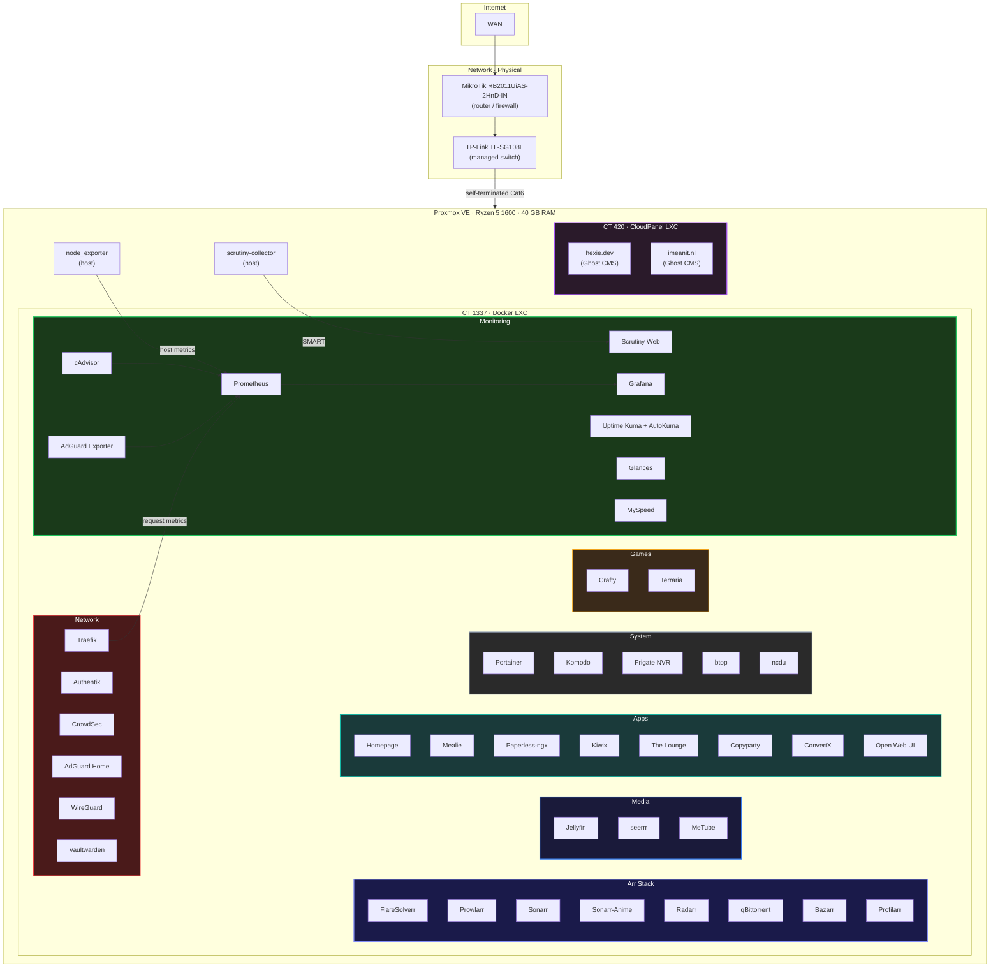

# - Homelab -

Self-hosted infrastructure running on Proxmox VE, fully containerized with Docker Compose. Each service lives in its own directory with a `docker-compose.yaml` and `.env` - clone, configure, deploy.

> **Why?** Because cloud subscriptions add up, self-hosting teaches you more in a weekend than a month of tutorials, and it's fun.

---

## -> Architecture



---

## -> Hardware

| Component | Spec |
|---|---|
| **CPU** | AMD Ryzen 5 1600 (6C/12T) |
| **RAM** | 40 GB DDR4 |
| **Boot** | ZFS NVMe mirror (root pool) |
| **Storage** | 18 TB HDD (media, backups) · SSD (databases, backup target) |
| **Hypervisor** | Proxmox VE |
| **Router** | MikroTik RB2011UiAS-2HnD-IN |
| **Switch** | TP-Link TL-SG108E (managed) |
| **Cabling** | Self-terminated Cat6 |

---

## -> Services

40+ containers, each with its own Compose file:

### Network
| Service | What it does |
|---|---|
| [Traefik](traefik/) | Reverse proxy with automatic TLS via Cloudflare DNS challenge |
| [Authentik](authentik/) | SSO - domain-level forward auth via Traefik for all services |
| [CrowdSec](crowdsec/) | Collaborative IDS/IPS - behavioral threat detection |
| [WireGuard](wg-easy/) | VPN with a web UI |
| [AdGuard Home](adguard/) | Network-wide DNS filtering with `*.${BASE_DOMAIN}` rewrite |
| [Vaultwarden](vaultwarden/) | Bitwarden-compatible password manager |

### Monitoring
| Service | What it does |
|---|---|
| [Grafana](grafana/) | Dashboards - Node Exporter Full, cAdvisor, Traefik, AdGuard |
| [Prometheus](prometheus/) | Metrics collection with cAdvisor and AdGuard exporter |
| [Uptime Kuma](uptime-kuma/) | Uptime monitoring with AutoKuma auto-discovery from Docker labels |
| [Glances](glances/) | Real-time system monitoring with host PID and filesystem visibility |
| [Scrutiny](scrutiny/) | S.M.A.R.T. disk health monitoring (collector on Proxmox host) |
| [MySpeed](myspeed/) | Internet speed tracking over time |

### Media
| Service | What it does |
|---|---|
| [Jellyfin](jellyfin/) | Media server - dual-domain (`jellyfin.hexie.dev` + internal) |
| [seerrr](seerr/) | Media request management |
| [MeTube](metubedl/) | YouTube video/audio downloader |

### Arr Stack
| Service | What it does |
|---|---|
| [Sonarr](sonarr/) | TV show automation |
| [Sonarr-Anime](sonarr-anime/) | Anime-specific Sonarr instance |
| [Radarr](radarr/) | Movie automation |
| [Bazarr](bazarr/) | Subtitle management |
| [Prowlarr](prowlarr/) | Indexer manager for the *arr stack |
| [Profilarr](profilarr/) | Quality profile sync across *arr instances |
| [qBittorrent](qbittorrent/) | Download client |
| [FlareSolverr](flaresolverr/) | Cloudflare challenge solver for Prowlarr |

### Apps
| Service | What it does |
|---|---|
| [Homepage](homepage/) | Dashboard - single pane of glass for all services |
| [Mealie](mealie/) | Recipe manager and meal planner |
| [Paperless-ngx](paperless-ngx/) | Document management with OCR (English + Romanian) |
| [Kiwix](kiwix/) | Offline Wikipedia and other ZIM archives |
| [The Lounge](thelounge/) | Self-hosted IRC client |
| [Copyparty](copyparty/) | File sharing and upload portal |
| [ConvertX](convertx/) | Convert any file |
| [Open Web UI](open-webui/) | Web UI for self hosted ML Models |

### System
| Service | What it does |
|---|---|
| [Portainer](portainer/) | Container management UI |
| [Komodo](komodo/) | Container deployment and management |
| [Frigate](frigate/) | NVR with real-time object detection |
| [btop](btop/) | Process viewer (web-based terminal) |
| [ncdu](ncdu/) | Disk usage analyzer (web-based terminal) |

### Games
| Service | What it does |
|---|---|
| [Crafty](crafty/) | Minecraft server manager (tModLoader) |
| [Terraria](terraria/) | Terraria tModLoader server |

### Headless
| Service | What it does |
|---|---|
| [Discord Bot](discord-bot/) | Custom IP notification bot |

---

## -> Compose Pattern

All services follow a standardized template:

```yaml
x-traefik-labels: &traefik-template
  traefik.enable: true
  traefik.http.routers.<service>-http.rule: Host(`${APP_NAME}.${BASE_DOMAIN}`)
  # ... HTTP → HTTPS redirect, TLS, certresolver

x-homepage-labels: &homepage-template
  homepage.group: ${HOMEPAGE_GROUP}
  homepage.name: ${HOMEPAGE_NAME}
  # ... icon, href, description, widgets

x-kuma-labels: &kuma-template
  kuma.<service>.http.name: ${HOMEPAGE_NAME}
  kuma.<service>.http.url: https://${APP_NAME}.${BASE_DOMAIN}
  # ... retries, interval

services:
  service:
    container_name: ${APP_NAME}
    image: image:${IMAGE_TAG:-latest}
    labels:
      <<: [*traefik-template, *homepage-template, *kuma-template]
```

**Key patterns:**
- YAML anchors for Traefik, Homepage, and Uptime Kuma labels
- `.env` files with `APP_NAME`, `APP_PORT`, `BASE_DOMAIN`, `IMAGE_TAG`
- Label keys are hardcoded (Docker Compose doesn't interpolate env vars in keys), values use `${VAR}`
- Two Docker networks: `frontend` (Traefik-exposed) and `backend` (internal comms)
- Multi-service stacks use additional anchors for shared environment variables

---

## -> Monitoring Stack

```
Proxmox Host                    Docker LXC
┌──────────────┐    scrape     ┌──────────────────────────┐
│ node_exporter├──────────────►│ Prometheus               │
└──────────────┘               │  ├─ cAdvisor (containers)│
                               │  ├─ Traefik metrics      │
┌──────────────┐    push       │  └─ AdGuard exporter  |  │
│ Scrutiny     ├──────────────►│                       v  │
│ collector    │               │ Grafana ◄── Prometheus   │
└──────────────┘               │                          │
                               │ Uptime Kuma + AutoKuma   │
                               │  └─ auto-discovers from  │
                               │     Docker labels        │
                               └──────────────────────────┘
```

- **Prometheus** scrapes node_exporter (Proxmox host), cAdvisor (container metrics), Traefik (request metrics), AdGuard exporter (DNS stats) at 60s intervals with 90-day retention
- **Grafana** dashboards: Node Exporter Full (1860), cAdvisor (14282), Traefik (17346), AdGuard (13330)
- **Uptime Kuma** monitors all services via HTTPS with Discord + email alerts
- **AutoKuma** auto-discovers monitors from Docker container labels
- **Scrutiny** collector runs on Proxmox host, ships SMART data to web UI in Docker

---

## -> Security

- **Traefik** handles TLS termination with auto-renewed Let's Encrypt certificates (Cloudflare DNS challenge)
- **Authentik** provides domain-level SSO via Traefik forward auth - one login protects all `*.${BASE_DOMAIN}` services
- **CrowdSec** runs behavioral analysis and shares threat intelligence with the community blocklist
- **WireGuard** encrypts all remote access - nothing is exposed without the tunnel
- **AdGuard Home** blocks malicious domains at the DNS level with local DNS rewrite for `*.${BASE_DOMAIN}`
- **Vaultwarden** manages all credentials with Bitwarden-compatible clients

---

## -> Backups

Daily automated backups to `/ssd/backups` with 14-day retention:

| What | How |
|---|---|
| Vaultwarden | SQLite hot backup + RSA keys + attachments |
| Authentik | `pg_dump` of PostgreSQL |
| Immich | `pg_dump` of metadata database |
| Komodo | `mongodump` compressed |
| Scrutiny | SQLite copy |
| Uptime Kuma | SQLite hot backup |
| Paperless-ngx | Built-in document exporter |
| AdGuard, Traefik, Prometheus, Grafana | Config files |
| All `.env` files | Centralized secret backup |

---

## -> Email

All transactional email flows through **Brevo SMTP** (`smtp-relay.brevo.com`), configured on:
Authentik · Vaultwarden · Immich · Mealie · Grafana (alerts) · Paperless-ngx

---

## -> Roadmap

### Kubernetes Migration (Planned)

The next major evolution: migrating from Docker Compose to **k3s** on Proxmox for reproducible, declarative infrastructure.

**Migration plan:**

1. **Sandbox** - Spin up a k3s instance, learn `kubectl`, get comfortable
2. **Foundation** - k3s with Longhorn (storage) + Traefik (ingress)
3. **Stateless first** - Migrate simple services (Homepage, AdGuard, monitoring)
4. **Media stack** - Migrate the *arr suite + Jellyfin
5. **Stateful and heavy** - Immich, Frigate, game servers
6. **GitOps** - FluxCD pointed at this repo for fully automated deployments

---

## -> Repo Structure

```
.
├── .template/              # Boilerplate for new services
├── service-name/
│   ├── docker-compose.yaml
│   └── .env                # Secrets - gitignored
├── projects/               # Misc project files
└── README.md
```

Each service directory contains at minimum a `docker-compose.yaml`. Configs, `.env` files, and secrets are `.gitignore`'d.

---

## -> Getting Started

```bash
# Clone the repo
git clone https://github.com/hexiejexie/homelab.git
cd homelab

# Copy the template for a new service
cp -r .template my-new-service
cd my-new-service

# Edit .env with your values, then deploy
docker compose up -d
```

> Most services expect `frontend` and `backend` Docker networks and properly configured `.env` files. Check each service's compose file for required variables.

---

## -> License

This is a personal homelab config repo. Feel free to use it as reference or inspiration for your own setup!